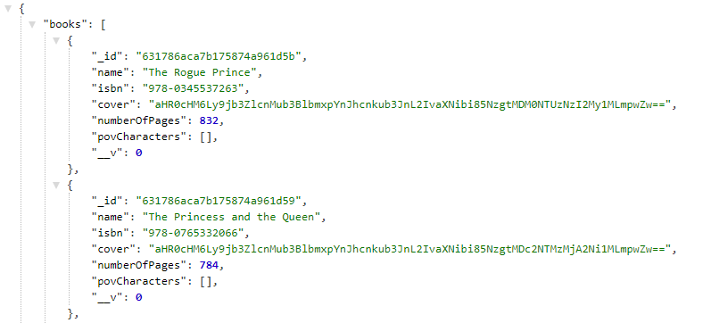
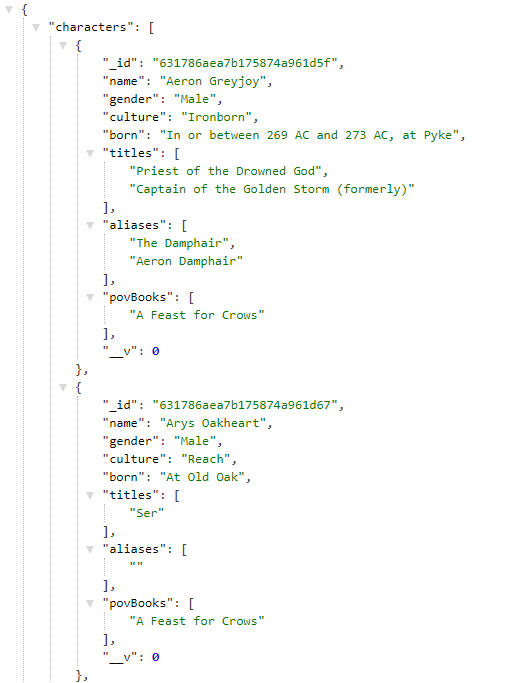

<h1 align="center">API: Crônicas Gelo e Fogo </h1>

 🚀 Um desafio que me fez aprender bastante sobre backend. Consumi outras 2 API para a construção.

<h1 align="center"></h1>

•
 <a href="#objetivo">Objetivo</a> •
 <a href="#tecnologias">Tecnologias</a> • 
 <a href="#autor">Autor</a> •

<h1 align="center">
    
    
    
</h1>

## **Objetivo**

 🔍 Estudando sobre API, Backend 

## **Tecnologias**

<ul>⚙️ Backend
    <li>🛠 Express
    <li>🛠 MongoDB Atlas
    <li>🛠 API base 1: https://anapioficeandfire.com/api/books/
    <li>🛠 API base 1: https://openlibrary.org/dev/docs/api/covers
    
   
</ul>

## **Autor**

 Desenvolvido por <a href="https://github.com/valtercfjunior">Valter Junior</a> 

